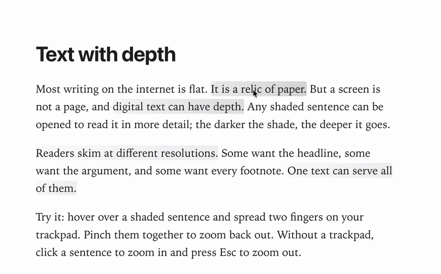

# Layered

Text on the web is flat, a habit inherited from paper. **Layered** is a small prototype for writing and reading text with depth. Any sentence can open into a page of its own, and each sentence on that page can open again, as deep as the writer likes.

Readers skim the surface and zoom in only where they care. Pinch on a shaded sentence and it grows into the headline of its own page. Pinch out to return.

**[Try the live demo →](https://aartoghrul.github.io/layered/)**

<p align="center">
  
</p>

## Install and run

Requires Node.js 20.19+ or 22.12+.

```sh
npm install
npm run dev      # http://localhost:5173
npm run build    # production build in dist/
```

## Use

The window has two panes: an editor on the left and a reader on the right.

**Writing (left pane)**
- Select a sentence and press **⌘E** (or **Add depth** in the menu that pops up over the selection). A box opens below, where you write what the sentence zooms into.
- Sentences inside that box can have depth of their own, to any level.
- To remove a sentence's depth, place the cursor inside it and choose **Remove depth**.

**Reading (right pane)**
- Sentences with depth are shaded. The darker the shade, the more layers lie beneath.
- **Zoom in:** spread two fingers on the trackpad over a shaded sentence, or click it.
- **Zoom out:** pinch two fingers together, press **Esc**, or ⌥-click.
- The zoom follows your fingers and springs to the nearer end when you let go.

Your document saves automatically in the browser. Use **Export** and **Import** to move it around as JSON, and **Reset sample** to restore the example text. **Reset sample** replaces your current document.

## How it works

Vite + React + TypeScript, with [TipTap](https://tiptap.dev) for the editor and [Motion](https://motion.dev) for the springs. Each page is a TipTap document. A sentence with depth carries a `depth` mark that points to the page it opens into (`src/model`).

The reader (`src/renderer`) turns a trackpad pinch into zoom progress. Chrome, Edge and Firefox report pinches as ctrl+wheel events; Safari has its own gesture events. As you pinch, the outer page and the sentence's page move together like one camera, so the sentence scales smoothly into its headline.

## Credits

**Idea.** Inspired by Milo Johnson's idea of papers with clickable depth, proposed as the eLife Innovation Sprint 2021 project [*Building tools for readable papers with clickable depth*](https://elifesciences.org/labs/8d2f27e3/elife-innovation-sprint-2021-applications-are-now-open).

**Implementation.** Authored by [**aartoghrul**](https://github.com/aartoghrul) ([alishbay.li](https://alishbay.li/)) and written by Claude Opus 5.5.

## License

[Apache License 2.0](LICENSE). You're free to use, modify and distribute Layered, including commercially. Keep the [`NOTICE`](NOTICE) file with any copy or derivative work, as the license requires.

If you build on Layered, please credit it with a link to this repository. To cite it, use GitHub's **Cite this repository** button (from [`CITATION.cff`](CITATION.cff)).
